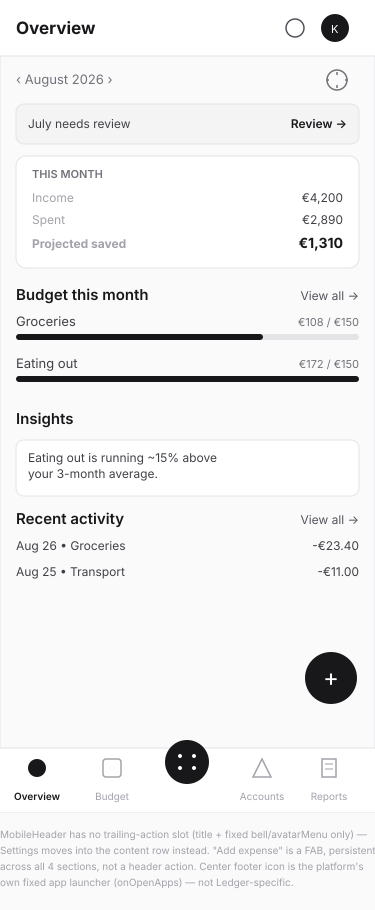
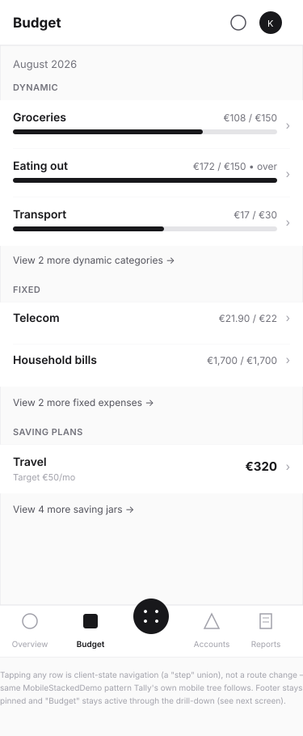
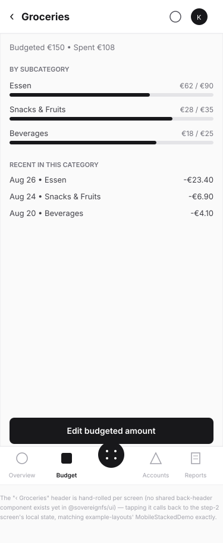
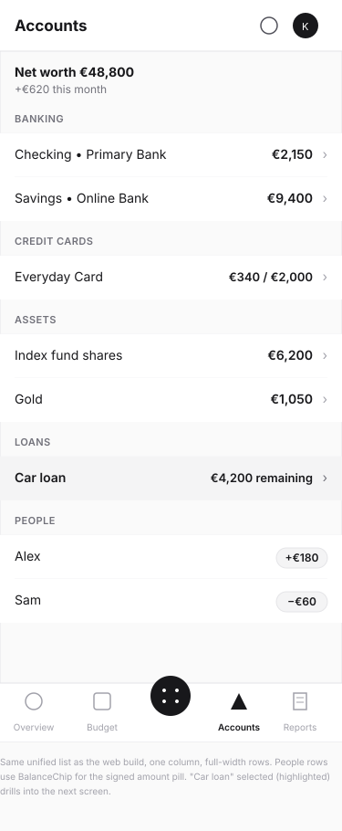
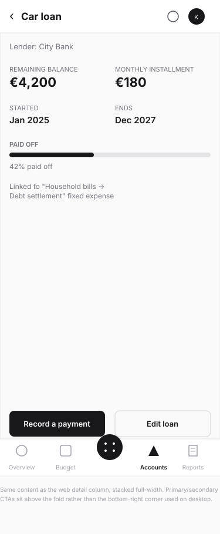
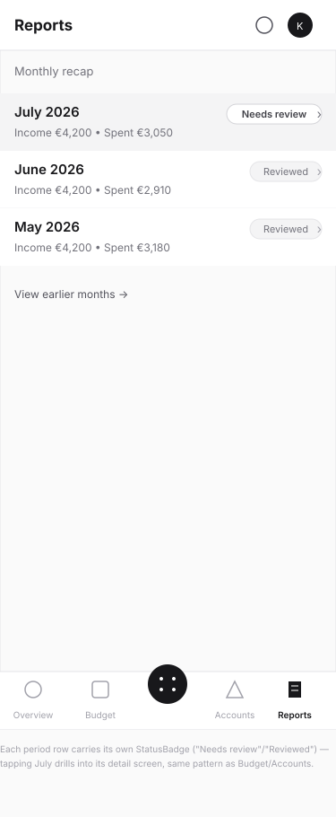
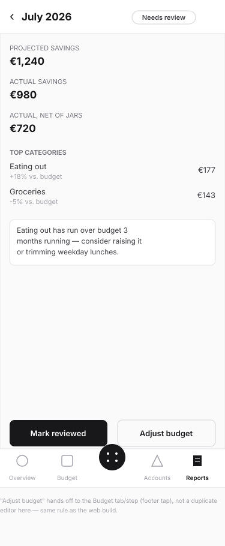
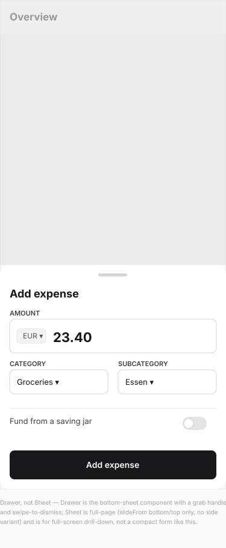

# Ledger — mobile fork wireframes

**Status:** Wireframe (pre-implementation)\
**Follows:** [web-shell.md](web-shell.md) (the `ThreeColumnLayout` desktop
design this forks from).\
**Verified against:** `example-plugins/example-layouts` (`ThreeColumnDemo.tsx`
/ `MobileStackedDemo.tsx` — the actual reference implementation),
`packages/ui/src/components/{MobileHeader,MobileFooter,Drawer,Sheet,
ResponsiveSurface}`. Read the real component source rather than assuming
from `sovereign-plugin-tally.local/UI-FLOW.md`'s description of the same
pattern — see "Corrections" below, one of its claims doesn't hold up
against the actual code.

## Direction

`ThreeColumnLayout` has no responsive behavior of its own — mobile is a
completely separate component tree, forked with `ResponsiveSurface`:

```tsx
<ResponsiveSurface web={<LedgerThreeColumn />} mobile={<LedgerMobileStack />} />
```

The mobile tree is a self-rendered `MobileHeader`/`MobileFooter` pair
(`shellConfig: { mobileHeader: false, mobileFooter: false }`) wrapping a
local `step`-state stack — plain `useState`, not real route navigation —
exactly mirroring `example-layouts`' `MobileStackedDemo.tsx`. Four footer
destinations (Overview, Budget, Accounts, Reports) match `MobileFooter`'s
hard 2-per-side cap around the platform's own fixed center launcher, with
nothing left over for Settings — resolved below.

## Corrections vs. the closest sibling doc

Tally's own `UI-FLOW.md` describes "a trailing gear icon (Settings) and the
Add expense action" as always visible on its mobile header. Reading the
actual `MobileHeader` component shows this isn't supported: its only
overridable prop is `title` — `bell` and `avatarMenu` are fixed, required
slots, and there is no trailing-action slot at all. Whether Tally's own
build will hit this gap isn't this doc's concern, but Ledger's design here
is based on the real component, not that description. Two consequences:

- **"Add expense" is a floating action button**, not a header action —
  persistent across all four sections (drawn once, on Overview, but applies
  everywhere).
- **Settings** moves into a small icon in Overview's own content area
  (next to the month switcher), not the shared header.

Also worth flagging: `Sheet` (the component originally used for the desktop
add-expense panel in `web-shell.md` screen 6) only supports
`slideFrom: 'bottom' | 'top'` — **no `'right'` variant** — and is documented
as having no desktop equivalent at all. **Fixed 2026-08-27** —
`web-shell.md`'s screen 6 is now a centered `Dialog` (`size="md"`), which
also corrected a second error in the original: the scrim dims the full
viewport including the sidebar, not just the main column.

## Screens

### 1. Overview



- Condensed single-column version of the web dashboard: one combined
  summary card instead of three, 2 budget rows instead of 4, 1 insight, 2
  recent-activity rows — the real screen scrolls for the rest.
- Settings gear lives in the content row next to the month switcher.
- The FAB is the persistent "Add expense" entry point (screen 8).

### 2. Budget — list



- Same section grouping as web (Dynamic/Fixed/Saving plans), one column,
  trailing chevron per row signals it drills down rather than opening a
  detail pane in place.

### 3. Budget → Groceries detail



- Full-width replacement screen, not a route change — a hand-rolled
  `‹ Groceries` header (no shared back-header component exists yet) calling
  back to the list screen's local state.
- Footer stays pinned with Budget still active — you're still "in" Budget,
  just drilled one level down.
- Same content as the web detail column, stacked instead of side-by-side.

### 4. Accounts — list



- Same unified net-worth list as web. "Car loan" selected/highlighted,
  drilling into screen 5.

### 5. Accounts → Car loan detail



- Same facts as the web detail pane; primary/secondary actions sit above
  the fold instead of pinned bottom-right.

### 6. Reports — list



- Period rows carry their own review-status badge, same as web.

### 7. Reports → July 2026 detail



- Same three savings figures, category breakdown, insight, and review
  actions as the web detail column. "Adjust budget" hands off to the
  Budget footer destination rather than duplicating an editor here.

### 8. Add expense — Drawer



- `Drawer`, not `Sheet` — the bottom-sheet component with a grab handle and
  swipe-to-dismiss, `snapHeight: 'content'`. Category and subcategory sit
  side by side to fit the same fields as the desktop panel into less
  vertical space.
- The jar-funding toggle's second state (fields swapping to a jar picker)
  still isn't wireframed — same open item noted in `web-shell.md`.

## Open questions

- **No shared mobile back-header component exists yet.** Every drill-down
  screen in this pass hand-rolls its own `‹ Label` row, matching
  `example-layouts`' reference demo — but if a third plugin needs this same
  shape, it's a DS-first candidate for `packages/ui` rather than a third
  hand-rolled copy.
- Per-section empty states remain out of scope for all three wireframe
  passes so far.
- The setup wizard itself is now covered — see
  [setup-wizard.md](setup-wizard.md).
