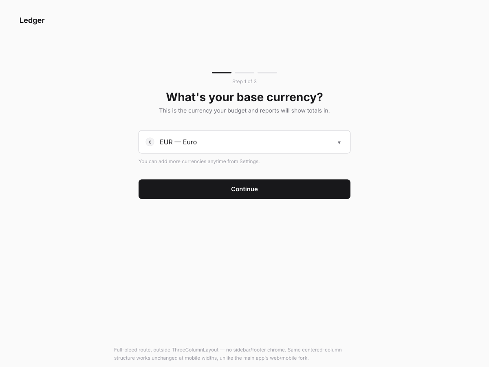
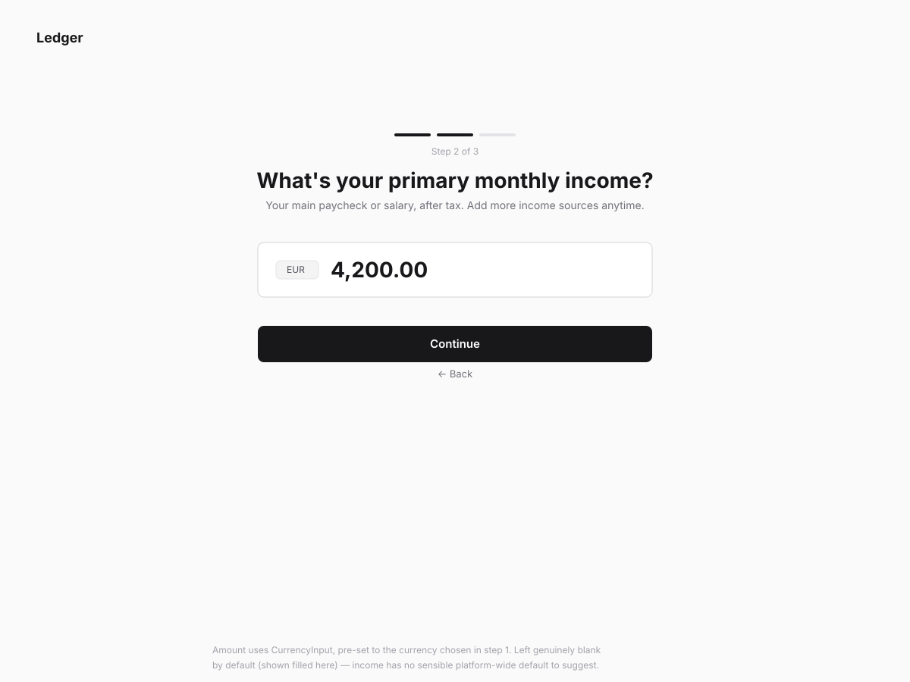
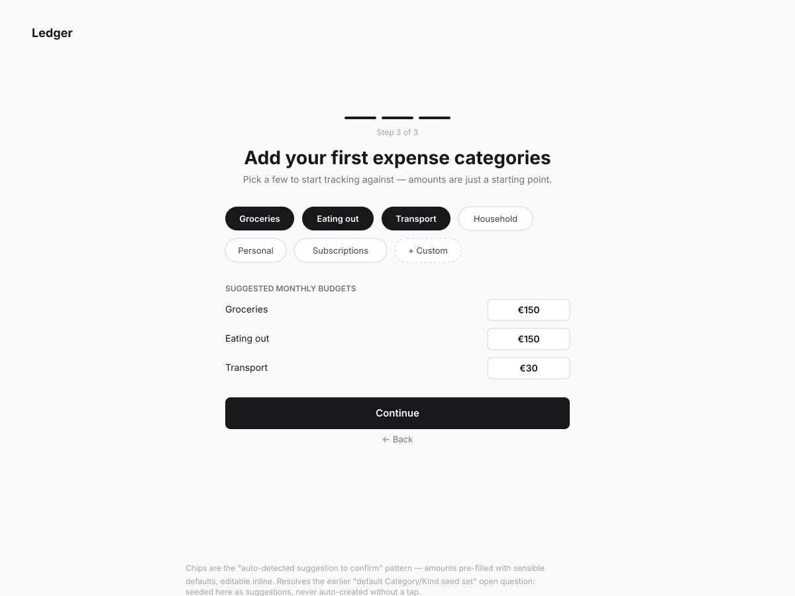
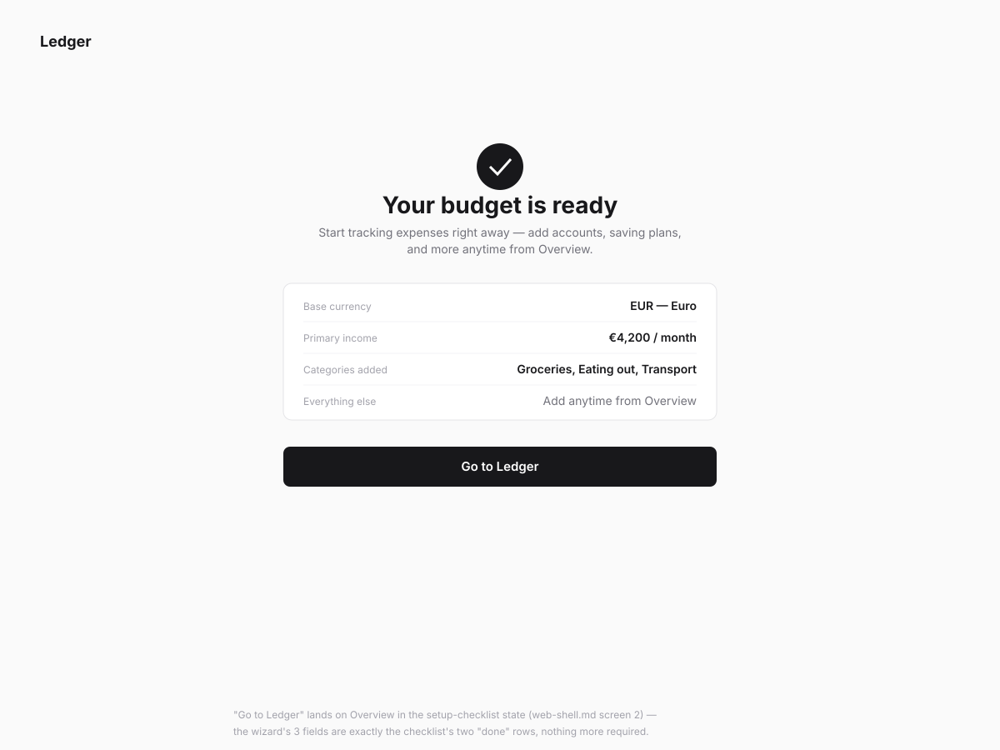

# Ledger — setup wizard wireframes

**Status:** Wireframe (pre-implementation)\
**Follows:** [CONCEPT.md](../../CONCEPT.md) §4's "short core wizard +
optional rest" setup shape, and [web-shell.md](web-shell.md) screen 2
(Overview's setup checklist), which this wizard hands off into.

## Direction

Three steps only — base currency, primary income, first expense
categories — then done. Everything else CONCEPT.md originally listed
(secondary incomes, saving plans, accounts, cards, stock, deposits, people,
loans) is deliberately **not** in this flow; it's reachable anytime from
Overview's setup checklist instead. This is a full-bleed route, outside
`ThreeColumnLayout` entirely — no sidebar, no footer, just a centered
column on a plain background. Unlike the main app, this doesn't need a
web/mobile fork: the centered-column structure holds up unchanged at any
width, the same way `Dialog` itself "becomes a full-screen sheet" on mobile
without needing a different component tree.

A 3-segment progress indicator at the top of every step sets expectations
up front — three short steps, not an open-ended form.

## Screens

### 1. Base currency

- Single field, defaulted to a sensible currency rather than an empty
  picker (exact default-detection logic — locale? instance config? — is an
  implementation detail, not resolved here).
- Helper text sets expectations that more currencies can be added later,
  directly resolving the multi-currency "add at setup or anytime" decision
  from earlier in this design.

### 2. Primary income

- `CurrencyInput` pre-set to the currency chosen in step 1.
- Deliberately left blank by default (shown filled here to depict a
  populated state, matching how the add-expense dialog wireframe was
  drawn) — income has no sensible platform default to suggest, unlike step
  3's categories.
- First step with a "Back" link — a plain centered text link beneath the
  primary button, not a header back-arrow (there's no persistent header in
  this flow to put one in).

### 3. First expense categories

- Tappable suggested-category chips (Groceries, Eating out, Transport,
  Household, Personal, Subscriptions) plus a "+ Custom" chip for anything
  not listed. Selecting one reveals it in the "suggested monthly budgets"
  list below with a pre-filled, editable amount.
- This is the resolution to the "default Category/Kind seed set" question
  left open in `web-shell.md`: categories are suggested, never
  auto-created without a tap, and their amounts are pre-filled suggestions
  the user confirms or edits — not a blank form, per the design system's
  "auto-detected suggestions to confirm" principle.
- At least one selection is required to continue (not visually distinguished
  in this static wireframe — a real build would disable Continue until
  one chip is selected).

### 4. Ready

- A plain confirmation summary, not another form. "Go to Ledger" lands
  directly on Overview's setup-checklist state — the wizard's three fields
  are exactly that checklist's first two "done" rows (currencies+incomes,
  expense categories); everything below them in the checklist is still
  open, by design.

## Engineering notes

No new components anticipated: `CurrencyInput`, plain chip-style toggle
buttons (check whether an existing `packages/ui` component covers a
tappable filter/selection chip, or whether this is a small addition — not
confirmed in this pass), `Input`/`Select` for the currency field.

## Open questions

- **Chip component**: whether `packages/ui` already has a tappable
  selection-chip primitive, or this needs a small addition — a real Design
  System Gap Check at implementation time, not decided here.
- **Currency default-detection logic** for step 1 isn't specified — locale,
  instance config, or a hardcoded fallback.
- **Validation states** (e.g. Continue disabled with no category selected,
  income field required) aren't drawn — this pass shows only the populated
  happy path per step, consistent with the other two wireframe passes so
  far.
