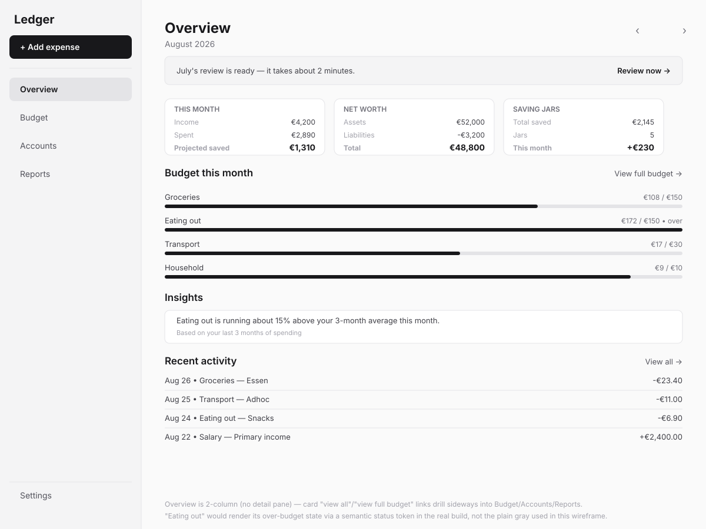
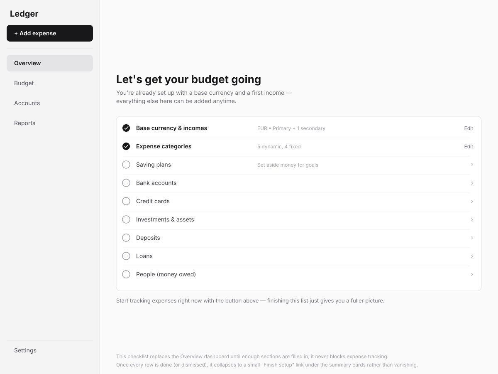
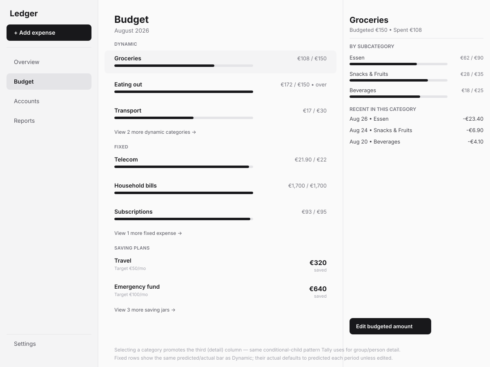
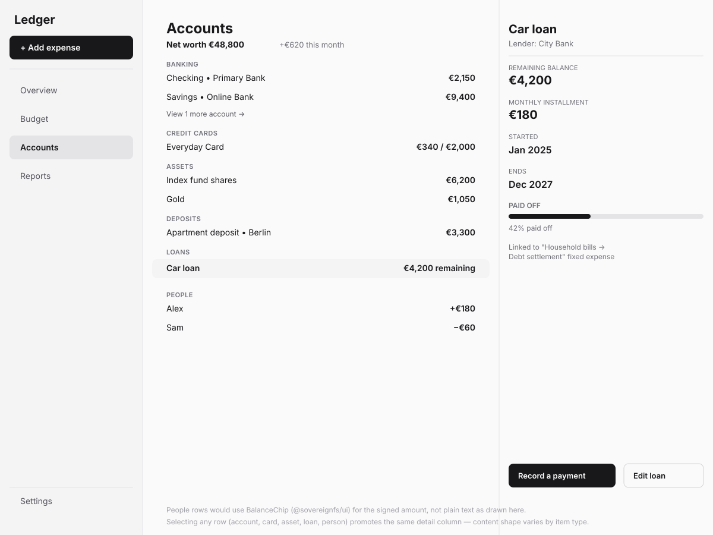
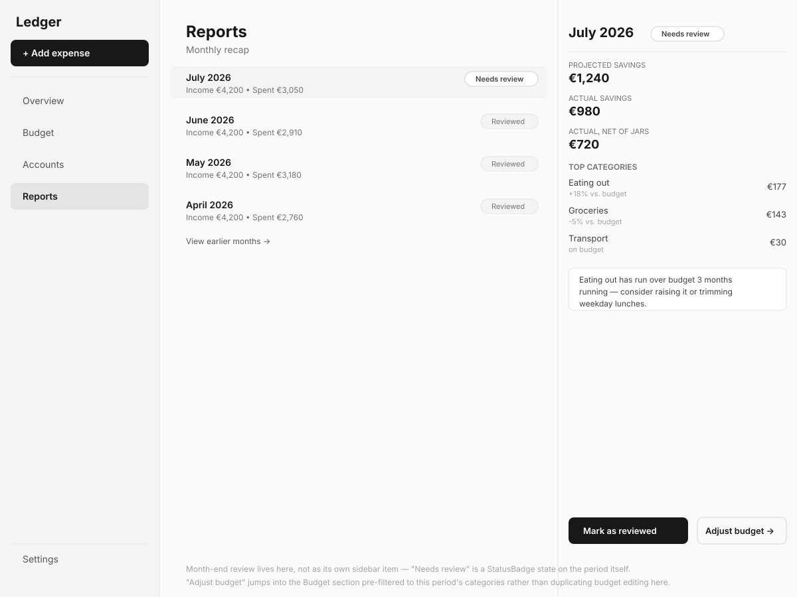
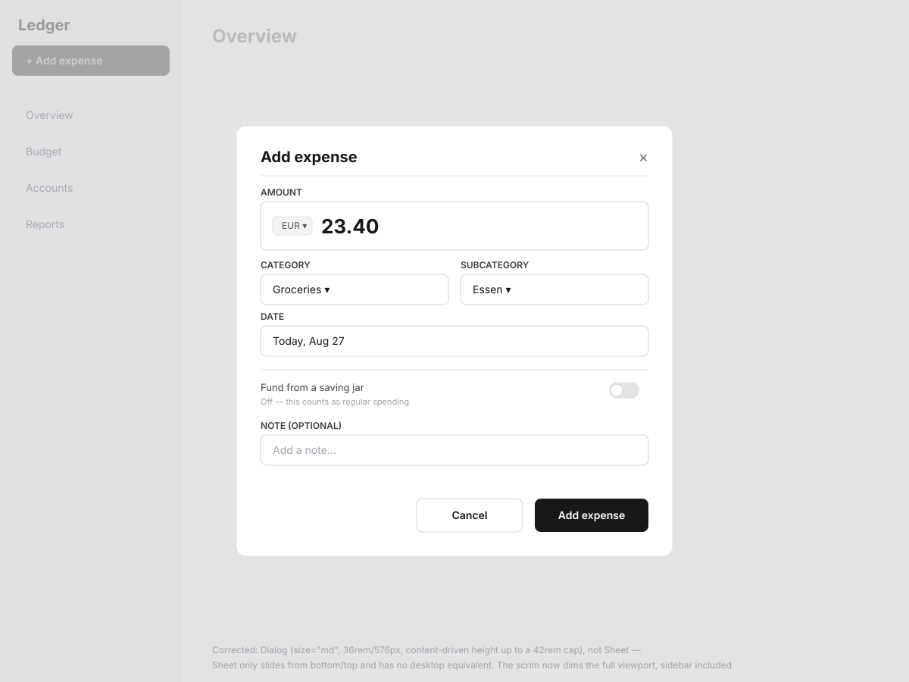

# Ledger — web shell wireframes

**Status:** Wireframe (pre-implementation)\
**Date:** 2026-08-27\
**Scope:** the web/desktop `ThreeColumnLayout` shell — Overview, Budget,
Accounts, Reports, and the add-expense overlay. Mobile is a separate
`ResponsiveSurface` fork (bottom-nav/carousel tree) and isn't wireframed in
this pass; the first-run setup wizard is also a separate pass (it's a
full-bleed route outside this shell, per [CONCEPT.md](../../CONCEPT.md) §5).

## Direction

Sidebar (240px) + main + a conditional detail column (360px), using
`ThreeColumnLayout` from `@sovereignfs/ui` — the same component and
proportions `sovereign-plugin-tally.local` already uses for its
sidebar/list/detail shape. Five sidebar destinations: Overview, Budget,
Accounts, Reports, Settings. "Add expense" is a pinned button above the nav
list, not a nav item — it opens an overlay, not a route change. Month-end
review is folded into Reports rather than given its own sidebar slot (a
period carries a "Needs review"/"Reviewed" status; the review action
happens against that period, not in a separate place). Full reasoning for
these calls is in the conversation that preceded this doc — this file
documents the resulting design, not the alternatives considered.

## Jargon table

| Internal/schema term | User-facing copy |
|---|---|
| Predicted (amount) | Budgeted |
| Actual (amount) | Spent |
| Kind | Subcategory |
| Dynamic / Fixed expense | Not shown as a distinction in the UI — both appear as plain categories in one Budget list, grouped by section header |
| Saving Jar | Kept as-is — already plain language |
| Person (signed ledger entry) | Shown by name, signed amount via `BalanceChip` |

## Screens

### 1. Overview — populated

- Two-column (no detail pane) — this is a dashboard, not a list/detail
  view. Each section's "view all"/"view full budget" link drills sideways
  into Budget/Accounts/Reports rather than opening a third column here.
- Three summary cards: this month (income/spent/projected saved), net
  worth, saving jars total.
- A condensed budget-progress list (top categories only) and an insights
  section sit below the cards, both linking into their full sections.
- The `SystemBanner`-style strip at the top is the month-end review nudge
  — only appears when a past period has an unreviewed status.

### 2. Overview — setup checklist (pre-full-setup state)

- Replaces the dashboard until enough of the budget is filled in. Matches
  the "short core wizard + progressive rest" setup shape agreed earlier —
  the two "done" rows (currencies/incomes, expense categories) are exactly
  the core wizard's scope; everything else is optional and reachable here,
  in any order, at any time.
- Never blocks expense tracking — the "+ Add expense" button is live from
  the very first screen.
- Once complete (or dismissed), this collapses to a small "Finish setup"
  link rather than disappearing outright, so a half-finished setup is
  never silently lost.

### 3. Budget — list + detail

- Main column groups categories by section (Dynamic, Fixed, Saving plans)
  with a budgeted-vs-spent bar per row — Fixed rows use the identical bar,
  since a fixed amount is still "predicted vs. actual," just usually
  closer to 100%.
- Selecting a category (Groceries, here) promotes the detail column:
  subcategory breakdown, recent transactions in that category, and an
  edit-budget action.
- Saving plan rows show target + jar balance instead of a budget bar —
  they're tracking a running balance, not a spend-against-budget.

### 4. Accounts — list + detail

- One net-worth total at the top, then every balance-sheet section
  (Banking, Credit cards, Assets, Deposits, Loans, People) in one list —
  the unified-accounts-screen decision from the concept discussion.
- Selecting any row — regardless of type — promotes the same detail
  column; its content shape adapts per item type (a loan's schedule here;
  a person's ledger, a jar's history, etc. for other types).
- People rows are drawn as plain text in this wireframe but are meant to
  use `BalanceChip` in the real build.

### 5. Reports — list + detail, review folded in

- Main column lists periods, most recent first, each with income/spent and
  a review-status badge.
- Detail column for the selected period: the three savings figures
  (projected / actual / actual-net-of-jars), a category breakdown, an
  insight card, and — only when the period needs it — review actions.
- "Adjust budget" jumps into the Budget section rather than duplicating
  budget-editing UI here.

### 6. Add expense — overlay

**Corrected 2026-08-27** — originally drawn as a `Sheet` sliding from the
right; `Sheet` only supports `slideFrom: 'bottom' | 'top'` and is
documented as having no desktop equivalent at all. Rebuilt as a `Dialog`
(`size="md"` — 36rem/576px fixed width, content-driven height up to a
42rem cap), centered, matching how other compact desktop forms in this app
family are actually built. The scrim now correctly dims the full viewport
including the sidebar, per the real component's own documented behavior
— the original version left the sidebar undimmed, which was also wrong.

- Amount, category, subcategory, date (defaults to today), an optional
  "fund from a saving jar" toggle, and an optional note.
- Toggling "fund from a saving jar" is meant to swap category/subcategory
  for a single jar picker (not drawn as a separate state in this pass —
  worth its own wireframe once this direction is confirmed).

## Engineering notes

No new `packages/ui` components anticipated — everything drawn here maps to
existing components: `ThreeColumnLayout`, `Card`, `Progress`, `BalanceChip`,
`CurrencyInput`, `StatusBadge`, `SystemBanner`, `Dialog`, `EmptyState`. A
real Design System Gap Check happens at implementation time, not here, but
nothing in this pass looks like it needs a new primitive.

## Open questions

- **The "fund from a saving jar" toggle's second state** (category/
  subcategory replaced by a jar picker) isn't wireframed yet.
- **Empty states** for Budget/Accounts/Reports before any data exists in
  that section aren't wireframed — only Overview's empty/checklist state
  is. Each of those sections needs its own "no categories yet" /
  "no accounts yet" empty state per the wireframe-before-build checklist.
- **Mobile fork** (`ResponsiveSurface` + bottom nav/carousel tree) — done,
  see [mobile-fork.md](mobile-fork.md).
- **First-run wizard** screens — done, see [setup-wizard.md](setup-wizard.md).

## Phased plan

1. **Overview + Budget** (screens 1–3) — the dashboard and the primary
   budget-viewing surface. Independently shippable and demonstrates the
   `ThreeColumnLayout` pattern end to end.
2. **Accounts** (screen 4) — net worth view, additive to phase 1.
3. **Reports + review** (screen 5) — depends on at least one full month of
   tracked data to be meaningful; naturally lands after 1–2.
4. **Add-expense overlay** (screen 6) — needed as early as phase 1 in
   practice (it's the primary daily action), called out as its own phase
   here only because it's a cross-cutting overlay rather than a section.
